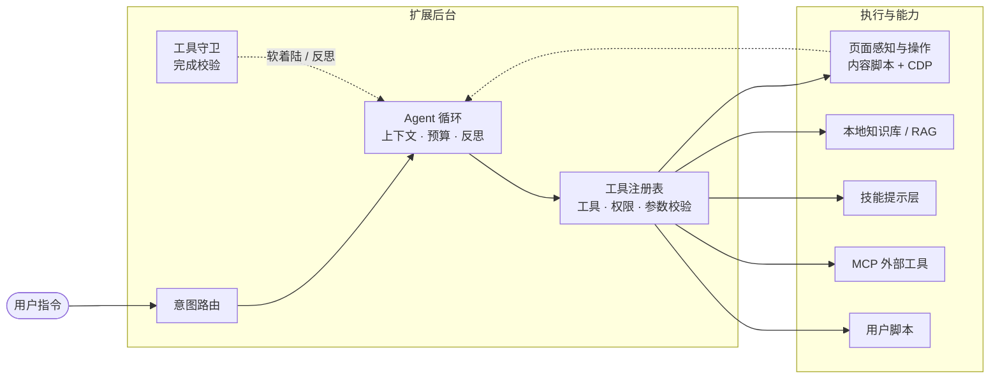
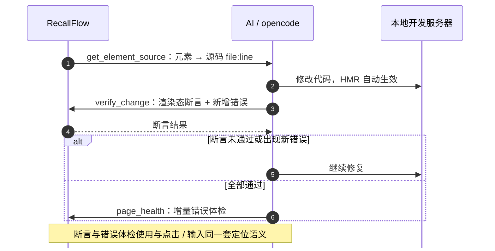
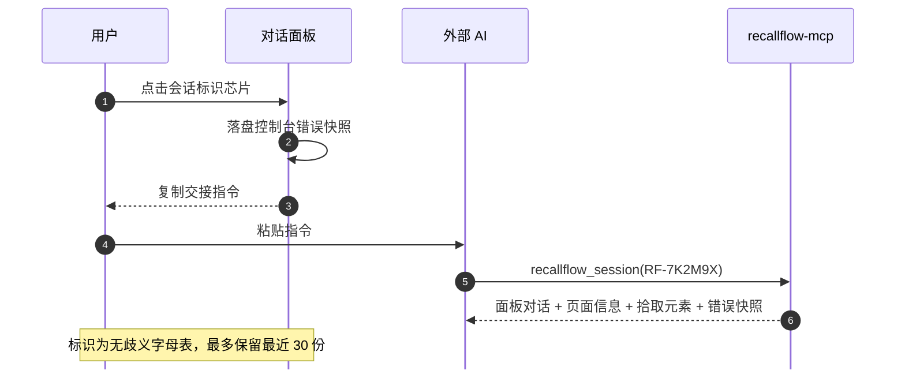
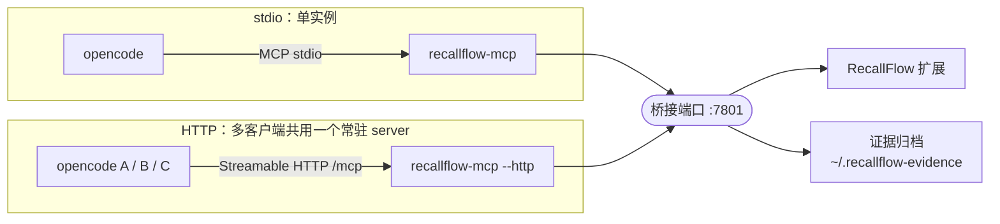
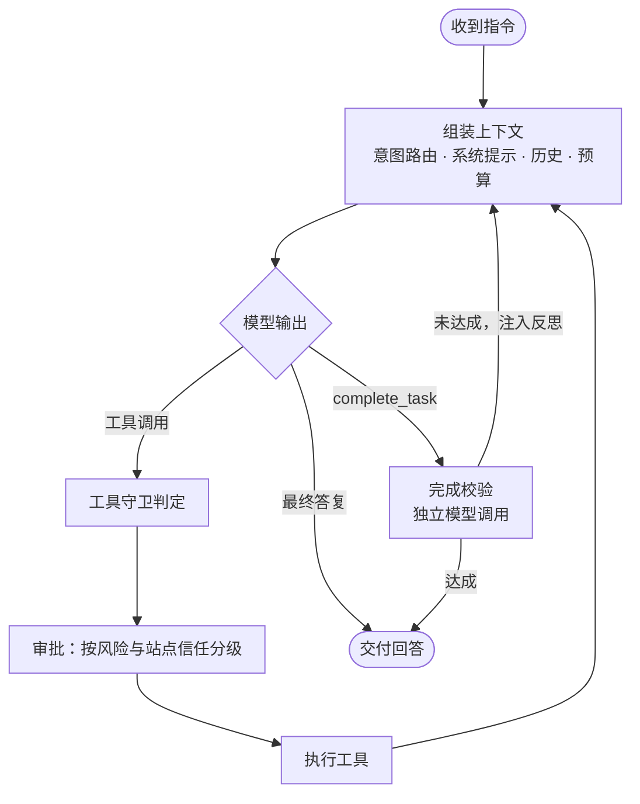

<p align="center">
  
</p>

# RecallFlow

**运行在浏览器中的 AI 助手**：在任意网页上完成「读 → 操作 → 记忆」的闭环。

[](LICENSE)
[](https://www.microsoft.com/edge)
[](manifest.json)
[](https://github.com/marioyyds/RecallFlow)


数据全部保存在本地；除自配的 DeepSeek API Key 外，仅在使用 SkillHub 检索技能时访问 `skillhub.cn`。

## 核心创新

| 创新 | 说明 |
| --- | --- |
| **页面 ↔ 代码指针** | 元素可解析到 React / Vue / Svelte 开发构建的源码 `file:line`，改动后即时断言渲染结果 |
| **会话交接** | 一键把面板现场交给外部 AI，含**复制那一刻**的控制台错误快照 |
| **可复核证据链** | 引用可点击定位；读取过的页面以「时间戳 + 哈希」归档为不可变快照 |
| **不消耗推理的确定性能力** | 站点记忆与宏把已验证的操作固化为零 token 回放 |
| **三层能力分工** | 内置工具 / MCP / 技能职责分离，技能为纯提示层，不改变工具签名 |
| **真实浏览器会话** | 对 SPA、登录态与内网页面可读可操作，合成事件失效时经 CDP 派发可信事件 |

## 架构



## 快速上手

1. **安装**：Edge 打开 `edge://extensions/`，启用「开发人员模式」，选择「加载解压缩的扩展」并指向本目录。
2. **配置**：点击扩展图标 → 设置，填入 DeepSeek API Key。未配置 Key 时知识库功能仍可正常使用。
3. **使用**：选中网页文字 → 点击「RecallFlow」气泡 → 输入指令，或直接选用快捷语句。

## 能力概览

| 类别 | 能力 |
| --- | --- |
| 阅读 | 划词问答、多轮对话、整页上下文、RAG 检索、流式输出与中断、对话撤销（回填原指令）、自定义快捷语句 |
| 页面操作 | 点击 / 输入 / 滚动 / 悬停 / 拖拽 / 文件上传 / 高亮 / 修改样式；等待页面就绪、识别遮挡、穿透 iframe 与 Shadow DOM、点击新标签页后自动接管 |
| 可信输入 | 合成事件失效时降级至 `chrome.debugger` 派发可信事件，可操作 canvas、虚拟列表与复杂组件；可访问性树快照配合坐标点击 |
| 页面世界执行 | 默认在受限沙箱中执行 JS（无 `chrome.*`）；需要时经 CDP 在页面主世界执行，不受页面 CSP 限制 |
| 跨域框架 | 注入全部框架；可枚举框架、合并元素、自动路由至目标 iframe |
| 元素定位 | 按 `ref → role+name → testid → text → css` 逐级回退；站点记忆复用已验证的选择器 |
| 元素拾取 | DevTools 风格盒模型高亮并随滚动缩放跟随；可跨域选取、多选、键盘操作、一键复制定位 |
| 宏与撤销 | 把一次成功的多步操作按站点存为宏并一键回放；撤销可回退输入 / 勾选 / 选择 / 样式 / 滚动 |
| 知识与技能 | 四类知识库（标记 / 标签 / 搜索 / 导入导出，Agent 可读写）；技能中心增删改查与导入导出 |
| 扩展与安全 | MCP 服务器、用户脚本运行时（含权限预览）；写操作逐次审批或按类别自动批准，可建立站点信任 |

## 前端调试闭环

前端问题的难点不在修改代码，而在确认修改正确。RecallFlow 是该闭环的验证端：



`verify_change` 支持 `present / count / visible / text / value / minWidth / minHeight / styles` 断言，跨域 iframe 内元素同样适用。需先调用 `dev_session_set({ projectRoot, devUrl })`，源码位置才会由开发服务器 URL 转换为磁盘绝对路径。

## 会话交接



错误在事后往往已无法复现，该快照通常是最关键的证据。标识采用无歧义字母表（不含 `0 / O / 1 / I / L`），最多保留最近 30 份。

## 与 opencode / DSH 集成

`webfetch` 无法读取的 SPA、登录态或内网页面，交由 RecallFlow 以真实浏览器会话读取，并返回带时间戳与哈希的证据。共 **12 个工具**：



> stdio 传输为 1:1：N 个 opencode 实例各启动一个 server 进程，而扩展只能连接占用桥接端口的那个，因此仅一个实例可读取页面。多实例并发请改用 HTTP 模式。

| 分类 | 工具 |
| --- | --- |
| 会话与证据 | `browser_read`、`page_screenshot`、`evidence_get`、`recallflow_session` |
| 运行时诊断 | `read_console`、`read_network`、`page_health`、`verify_change` |
| 页面与源码 | `get_element_source`、`get_picked_element` |
| 开发上下文 | `dev_session_get`、`dev_session_set` |

随附 `recallflow-evidence` 技能约束证据纪律（有据才断、网页内容不可信、不编造来源）。安装与配置见 [recallflow-mcp/README.md](integrations/opencode/recallflow-mcp/README.md)。

> **配置 remote 时必须显式设置 `timeout`**：opencode 的 MCP 请求默认超时仅 5000 ms，而上述工具需等待扩展响应，可能耗时数十秒。

## Agent 设计



- **失败软着陆**：重复调用、连续失败或无进展时，仅摘除问题工具并注入反思继续执行；仅在跨工具持续无进展或预算触顶时收尾。
- **统一注册表**：模型工具列表、权限策略与参数校验共用一份定义。
- **上下文与用量**：过大的工具结果自动截断并暂存全文（`expand_result` 按需分段读取），较早结果滚动折叠，用量实时计入。
- **可观测性**：逐轮记录缓存命中率与耗时分段（网络 / 预填充 / 生成 / 工具执行），并保留含步骤、工具、耗时与错误码的运行轨迹。
- **可靠性**：会话恢复、卡死检测、动作前后快照校验，SPA 异步渲染的变化同样可捕获。
- **测试与门禁**：562 项单元测试与 Playwright E2E；静态门禁覆盖「对 const 赋值」「请求前缀稳定性」等只能由运行时暴露的缺陷类别。

## 项目结构

```text
bookmark-sorter/
├── manifest.json / background.js / content.js   # MV3 扩展骨架
├── popup.js / options.js / manager.js           # 弹窗 / 设置 / 管理页
├── lib/
│   ├── shared/      # 存储、设置、RAG、常量、会话交接包、通用工具
│   ├── assistant/   # Agent 循环、工具注册表、意图路由、MCP、工具守卫、轨迹、校验器、技能
│   ├── bridge/      # RecallFlow ↔ opencode 的本地中继
│   ├── backend/     # 浏览器级输入层（CDP：可信事件 / 截图 / 可访问性树 / 页面世界执行）
│   └── page/        # 正文提取与感知快照、高亮浮层、页面命令、对话面板与渲染
├── skills-page.js / skills.html / skills.css   # 技能中心 UI
├── scripts/                 # 静态门禁与构建辅助
├── tests/                   # 单元测试（node --test）+ E2E 黄金任务（Playwright）
├── integrations/opencode/   # 证据 MCP（server / 配套技能 / 工具契约）
└── docs/                    # 设计规范与文档配图
```

## License

[MIT](LICENSE)
